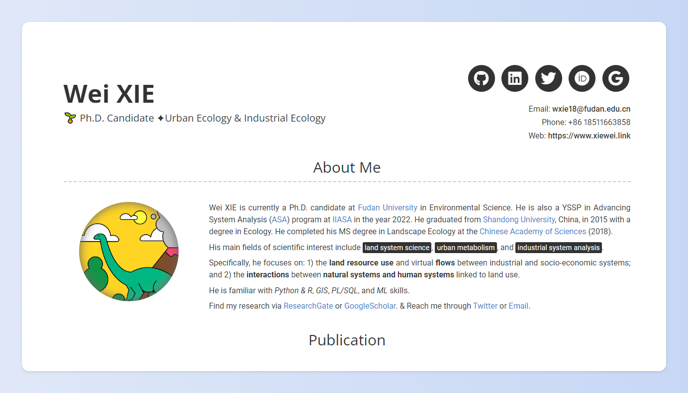

# WELCOME

Personal Curriculum Vitae (CV) website of Wei.

Here is the right way to find Wei. :D

Link Wei through [xiewei.link](http://www.xiewei.link).

# Brief

Hi there! I am currently a Ph.D. Candidate in Environmental Science. Still a bit green but keep growthing!

Research focusing on: `Land Use` | `GIS` | `Urban Metabolism` | `System Analysis`

Capabilities: `GIS/RS` | `SQL (Geospatial)` | `Stastics & Coding (Matlab/Python/R)` | `Web Design`

Upgrading: `Machine Learning / Deep Learning`

// Find my research via [ResearchGate](https://www.researchgate.net/profile/Wei-Xie-9) or [GoogleScholar](https://scholar.google.com/citations?user=XBUp9EoAAAAJ&hl=en&oi=ao).

// Reach me through [Twitter](https://twitter.com/wxie96) or [Email](mailto:wxie18@fudan.edu.cn).

----

## License

The theme is available as open source under the terms of the [MIT License](https://opensource.org/licenses/MIT).

Template forked from [here](https://github.com/sproogen/modern-resume-theme).
